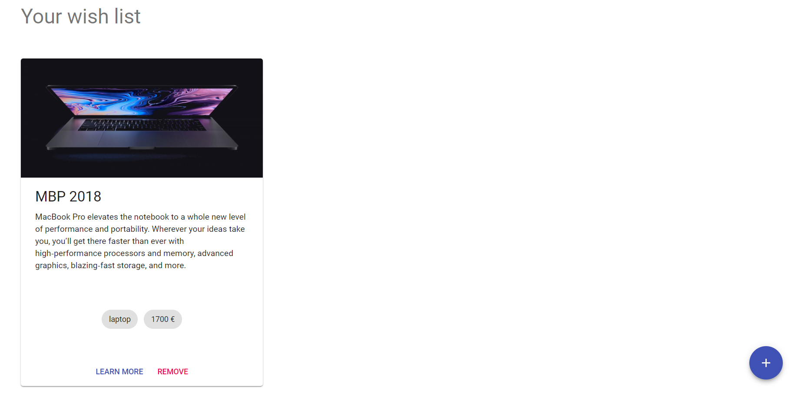
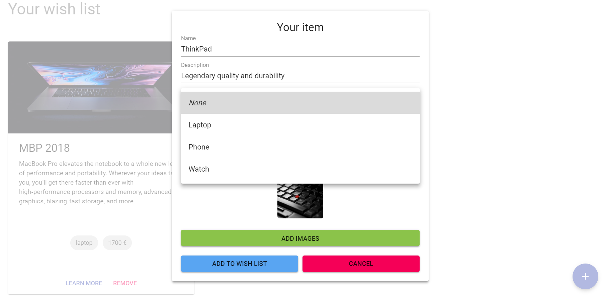

# Wish list
A full-stack web application allow users to store, add and delete their wish-list.
```javascript
  npm install
  npm install -prefix client
  npm run dev
```

## Tech stack
### Back-end
* NodeJS, Express, MongoDB
### Front-end
* React, Redux, Redux-thunk, Axios, Lodash, React-dropzone, Superagent
### UI Library
* MaterialUI

## Demo
### Home 

### Add a new item
